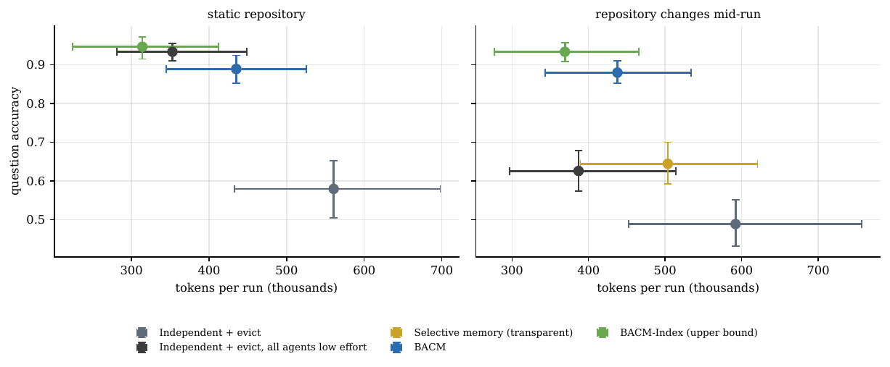
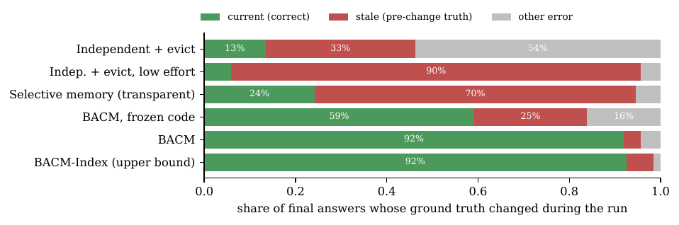

<div class="blog-split">
<div class="blog-split-main">
<p>When several LLM agents work on the same codebase in parallel, two things go wrong. They <strong>re-read the same files</strong> and re-derive the same facts, and, once the code changes, every agent keeps trusting <strong>what it read before</strong>. Shared memory fixes the first problem and makes the second one worse: a stale fact in shared memory misleads every agent that reuses it.</p>
<p>My paper, <strong>“BACM: Transparent, Provenance-Aware Shared Memory for Parallel LLM Agents on Changing Codebases”</strong>, asks one narrow question: <em>can a shared context manager keep parallel agents correct when the source changes mid-run, without making them more expensive?</em> This post is the short version. The full paper (24 pages), code, benchmark, cached model responses and analysis scripts are public.</p>
</div>
<aside class="blog-rail">
<p class="blog-rail-label">Read it</p>
<a class="blog-rail-btn" href="https://tejashvi-kumawat.github.io/assets/bacm-paper.pdf">Paper (PDF) →</a>
<a class="blog-rail-btn ghost" href="https://github.com/tejashvi-kumawat/bacm">Code &amp; benchmark</a>
<ul class="blog-rail-meta">
<li><strong>Author:</strong> Tejashvi Kumawat</li>
<li><strong>Model:</strong> GPT-5 mini (+ Gemini replication)</li>
<li><strong>Benchmark:</strong> RepoQA-Dyn, 5 real repos</li>
<li><strong>Protocol:</strong> pre-registered, held-out seeds</li>
</ul>
</aside>
</div>

## The headline result

On held-out runs with GPT-5 mini (30 runs per cell, 5 repositories × 6 seeds), BACM answered **89%** of questions correctly on static repositories and **88%** when a real release landed in the middle of the run. Independent agents with context eviction got **58%** and **49%**. Both differences are significant after Holm correction (p = 0.0006).

After the release, the number of **stale answers** (answers still equal to the pre-release truth) fell from **61 to 7 out of 186**.

<figure>

<figcaption>Accuracy against tokens per run (means with 95% confidence intervals). Better systems are up and to the left.</figcaption>
</figure>

## What BACM is

BACM (Branch-Aware Context Manager) treats agent memory the way a database treats derived data:

- **Typed knowledge objects with provenance.** Every base fact records the file, the version and the exact span of code that supports it. Derived facts record their dependencies and the typed rule that computes them.
- **Exact invalidation.** When a file changes, BACM keeps every fact whose supporting span is still present as a complete unit, and invalidates only the rest, plus everything derived from it.
- **Demand-driven recomputation.** Only the part of the affected graph that some open question still needs is recomputed, from the smallest view that supports it (one class body, one outline).
- **Transparent memory.** Agents never call the memory. The tool layer publishes what they read, serves already-read files as short digests, answers questions from known facts by typed rules, and keeps answers current after a change without waking the agents.

That last point came from a failure. My first design exposed memory as tools (`kb_query`, `kb_publish`). It kept answers current but cost *more* than independent agents, because every memory operation is another model turn that re-sends the whole context. The token cost model in the paper (Eq. 3) explains why, and fits measured runs with R² of 0.86–0.87.

## The surprising finding: reasoning is not consistency

I added a control where every independent agent reasons more (effort “low” instead of “minimal”). On **static** repositories it is as accurate as BACM (0.93 vs 0.89, not significant) and cheaper. But after a release it is stale for **167 of 186** changed answers, the most of any system.

Agents that reason more read the old code more accurately, and then keep what they read. Nothing in an agent’s context tells it that what it read has since changed. **State consistency is a property of the memory, not of the reasoning applied to it**, so it has to come from mechanism: provenance, versions and dependency-aware invalidation.

<figure>

<figcaption>Outcome of each answer whose truth changed during the run. Green is current; red is stale (the pre-release truth).</figcaption>
</figure>

## The benchmark: RepoQA-Dyn

Five real Python repositories (httpx, requests, flask, click, rich), each pinned at a release, with a later real release landing mid-run: files move, classes get re-parented, methods are added. Questions have exact ground truth from Python’s `ast` module (base file, grandbase, family files, method count, method total across ancestors), so accuracy is decided by the models’ reading, not by a judge.

| System | Static accuracy | Changing accuracy | Stale answers |
| --- | --- | --- | --- |
| Independent + evict | 0.58 | 0.49 | 61 / 186 |
| Independent + evict, low effort | 0.93 | 0.63 | 167 / 186 |
| Selective memory (transparent) | 0.89 | 0.64 | 131 / 186 |
| **BACM** | **0.89** | **0.88** | **7 / 186** |
| BACM-Index (upper bound) | 0.95 | 0.93 | 11 / 186 |

## What does not work (and I say so in the paper)

- **Token savings are not established.** Pooled token use changed by −22% (static) and −26% (changing), but neither is statistically significant. Per repository it ranges from −65% (click, changing) to +170% (requests, static), because the extraction calls cost more than the redundant reads they replace when relevant files are few and small. I claim consistency under change, not lower cost.
- **Extraction errors propagate.** Counts extracted by a model are the main source of error, and with shared memory one wrong count reaches every agent. With an exact symbol index instead of a model, the same architecture reaches 0.95 / 0.93 at lower cost.
- **Narrow benchmark.** Five repositories, one language, one release jump each, structural questions. End-to-end tasks scored by tests were not run. The second model family (Gemini 3.5 Flash-Lite) has only ten runs per cell, which supports the direction of the effect, not generality.
- **Two defects in my own implementation** were found after the pre-registered runs: a provenance span that covered only a class header, and a non-recursive rebuild of stale derived facts. Frozen and corrected results (0.76 → 0.88 accuracy, 46 → 7 stale) are reported side by side in Table 7, and the corrected numbers should be read as the intended design, not a fully pre-registered result.

## Reproduce it

Every number, table and figure is generated from the run logs, and all model responses are cached, so the analysis replays without new API calls. The pre-registration records a SHA-256 fingerprint of the frozen code, and every later change is logged as an amendment.

```bash
git clone https://github.com/tejashvi-kumawat/bacm
cd bacm
python -m bacm run --suite repobench2 --seed0 200 --seeds 6 \
  --archs independent_evict,selective_llm,bacm_llm,bacm_auto \
  --backend openai_compat --provider openai --model gpt-5-mini \
  --max-usd <cap> --out results_real/final
```

## Cite

> Tejashvi Kumawat. *BACM: Transparent, Provenance-Aware Shared Memory for Parallel LLM Agents on Changing Codebases.* 2026. [PDF](https://tejashvi-kumawat.github.io/assets/bacm-paper.pdf) · [Code](https://github.com/tejashvi-kumawat/bacm)

A `CITATION.cff` file is in the repository.
